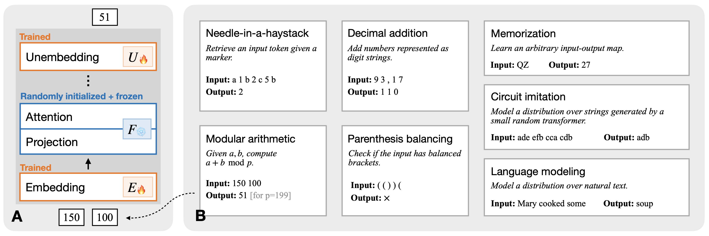

# Algorithmic Capabilities of Random Transformers

Official code for "Algorithmic Capabilities of Random Transformers" (NeurIPS 2024)




```bash
# Modular Addition
python modadd_exp.py --n_embd=512 --weight_frozen=0   # normal transformer
python modadd_exp.py --n_embd=512 --weight_frozen=1   # random transformer
# Needle-in-a-haystack
python experiment_stream.py --task=condattendstream_30
# Decimal Addition
python experiment_stream.py --task=additionstream_10
# Parenthesis Balancing
python experiment_stream.py --task=dyckstream_30
# Memorization
python hdmemorize_exp.py
# Language Modeling
python lm_train.py
# Circuit Imitation
python imitation.py
```